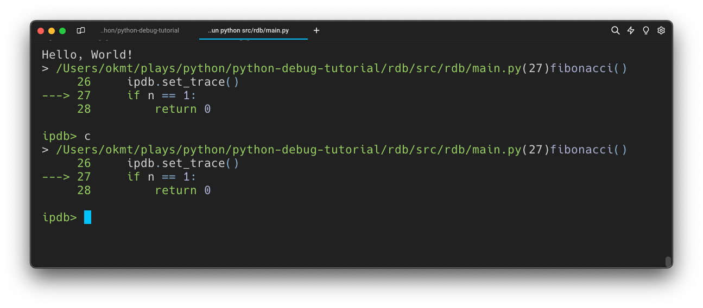
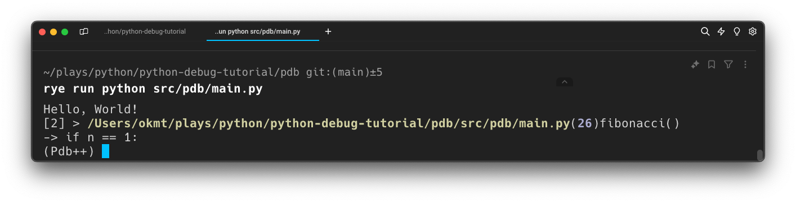

# pdb

pdb -- Python 標準実装のデバッガ

https://docs.python.org/ja/3/library/pdb.html

Python プログラム用の対話型ソースコードデバッガ。事後解析デバッギングもサポートし、プログラムの制御下で呼び出すことができる

```
import pdb; pdb.set_trace()
# or
breakpoint() # Python 3.7以降はビルトイン関数breakpoint()がset_trace()の代わりに使えるように
```

Python 実行時に引数を指定して起動することもできる

```
$ rye run python -m pdb src/rdb/main.py
```

| command                  | short command | description                                                                                 |
| ------------------------ | ------------- | ------------------------------------------------------------------------------------------- |
| help                     | h             | 利用できるコマンドの一覧を表示                                                              |
| where                    | w             | スタックの底にある最も新しいフレームと一緒にスタックトレースを表示                          |
| down                     | d             | スタックフレーム内で現在のフレームを count レベル (デフォルトは 1) 新しいフレーム方向に移動 |
| up                       | u             | スタックフレーム内で現在のフレームを count レベル (デフォルトは 1) 古いフレーム方向に移動   |
| break (lineno, function) | b             | 現在のファイルのその行番号の場所にブレークポイントを設定                                    |
| list                     | l             | 現在のファイルのソースコードを表示                                                          |
| return                   | r             | 関数の終わりまで実行する                                                                    |
| quit                     | q             | デバッグを終了する                                                                          |

# ipdb

ipdb -- ipdb exports functions to access the IPython debugger, which features tab completion, syntax highlighting, better tracebacks, better introspection with the same interface as the pdb module.

https://github.com/gotcha/ipdb

pdb と同じインターフェイスでより良いシンタックスハイライトでデバッグ可能な Python モジュール

```
$ rye add ipdb
$ rye sync
```

使い方は pdb とほぼ同じ

```
ipdb.set_trace()
```



タブで補完が効くようになり、pdb よりも使用可能なコマンドが多いようです

```
ipdb> h

Documented commands (type help <topic>):
========================================
EOF    clear      display  l         pfile    return           tbreak     where
a      commands   down     list      pinfo    retval           u
alias  condition  enable   ll        pinfo2   run              unalias
args   cont       exit     longlist  pp       rv               undisplay
b      context    h        n         psource  s                unt
break  continue   help     next      q        skip_hidden      until
bt     d          ignore   p         quit     skip_predicates  up
c      debug      j        pdef      r        source           w
cl     disable    jump     pdoc      restart  step             whatis

Miscellaneous help topics:
==========================
exec  pdb

Undocumented commands:
======================
interact
```

## pdb++

https://github.com/pdbpp/pdbpp

pdb++ -- This module is an extension of the pdb module of the standard library. It is meant to be fully compatible with its predecessor, yet it introduces a number of new features to make your debugging experience as nice as possible.

pdb++は pdb を置き換えて使用できるので、`import pdb`や`breakpoint()`のまま利用可能

```
$ rye add pdbpp
$ rye sync
```



コマンドラインの表記が`Pdb++`となっていることがわかる

使えるコマンドも pdb より多い

```
(Pdb++) help

Documented commands (type help <topic>):
========================================
EOF    cl         disable  help       list      quit     step       until
a      clear      display  hf_hide    ll        r        sticky     up
alias  commands   down     hf_unhide  longlist  restart  tbreak     w
args   condition  ed       ignore     n         return   track      whatis
b      cont       edit     interact   next      retval   u          where
break  continue   enable   j          p         run      unalias
bt     d          exit     jump       pp        rv       undisplay
c      debug      h        l          q         s        unt

Miscellaneous help topics:
==========================
exec  hidden_frames  pdb

Undocumented commands:
======================
f  frame  hf_list  inspect  paste  put  source
```
