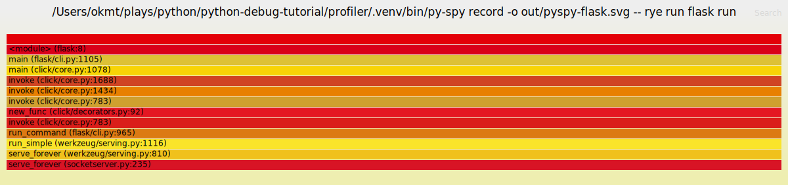
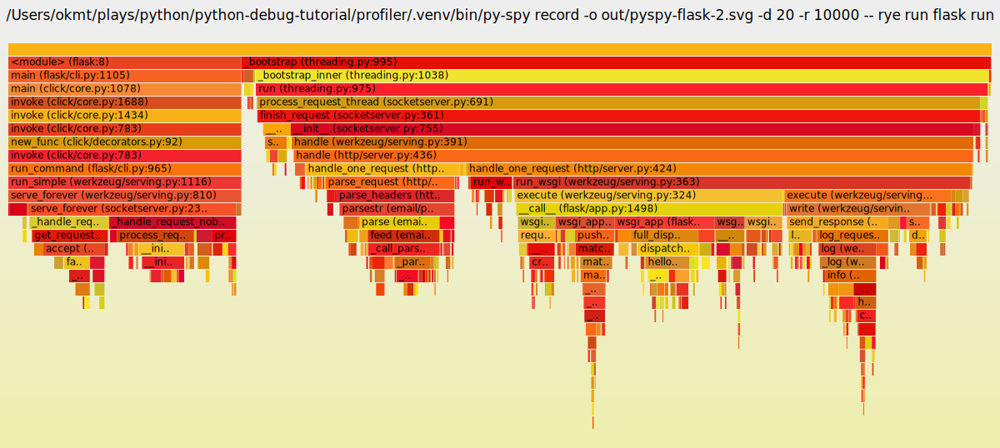

# profiler

Python Profiler -- プログラムの各部分がどれだけ頻繁に呼ばれたか、そして実行にどれだけ時間がかかったかという統計情報を取得する

https://docs.python.org/ja/3/library/profile.html

```
import cProfile
import re
cProfile.run('re.compile("foo|bar")', 'restats')
```

211 のプリミティブ実行

```
         218 function calls (211 primitive calls) in 0.000 seconds

   Ordered by: standard name

   ncalls  tottime  percall  cumtime  percall filename:lineno(function)
        1    0.000    0.000    0.000    0.000 <string>:1(<module>)
        1    0.000    0.000    0.000    0.000 __init__.py:225(compile)
        1    0.000    0.000    0.000    0.000 __init__.py:272(_compile)
        1    0.000    0.000    0.000    0.000 _compiler.py:214(_compile_charset)
```

```
import time


def main() -> None:  # noqa: D103
    word = "Hello world!"
    for s in word:
        time.sleep(1)
        print(s)


if __name__ == "__main__":
    main()

```

コマンドラインからも実行できます。

```
$ rye run python -m cProfile src/profiler/hello.py
```

- ncalls: 呼び出し回数
- toltime: 消費された合計時間（sub-function の呼び出しで消費された時間は除外されている）
- percall: tottime を ncalls で割った値
- cumtime: この関数と全ての sub function に消費された起動から終了までの累計時間。実行結果はデフォルトでこの値で並び替えられる。
- percall: cumtime をプリミティブな呼び出し回数で割った値
- filename:lineno(function): その関数のファイル名、行番号、関数名

```
$ rye run python -m cProfile -o out/hello.pstats src/profiler/hello.py
```

`-o` で出力ファイルを指定できる

Python の標準ライブラリに含まれる pstats モジュールや、gprof2dot、pyprof2calltree などのサードパーティツールを使用して保存したプロファイリングデータを解析できる

```
rye run python src/profiler/analyze.py out/hello.pstats
['src/profiler/analyze.py', 'out/hello.pstats']
Mon May 13 16:08:25 2024    out/hello.pstats

         28 function calls in 12.050 seconds

   Ordered by: internal time

   ncalls  tottime  percall  cumtime  percall filename:lineno(function)
       12   12.049    1.004   12.049    1.004 {built-in method time.sleep}
       12    0.001    0.000    0.001    0.000 {built-in method builtins.print}
        1    0.000    0.000   12.050   12.050 src/profiler/hello.py:4(main)
        1    0.000    0.000   12.050   12.050 src/profiler/hello.py:1(<module>)
        1    0.000    0.000   12.050   12.050 {built-in method builtins.exec}
        1    0.000    0.000    0.000    0.000 {method 'disable' of '_lsprof.Profiler' objects}


   Ordered by: internal time

Function                                          was called by...
                                                      ncalls  tottime  cumtime
{built-in method time.sleep}                      <-      12   12.049   12.049  src/profiler/hello.py:4(main)
{built-in method builtins.print}                  <-      12    0.001    0.001  src/profiler/hello.py:4(main)
src/profiler/hello.py:4(main)                     <-       1    0.000   12.050  src/profiler/hello.py:1(<module>)
src/profiler/hello.py:1(<module>)                 <-       1    0.000   12.050  {built-in method builtins.exec}
{built-in method builtins.exec}                   <-
{method 'disable' of '_lsprof.Profiler' objects}  <-
```

可視化するためにはライブラリを使って

```
$ rye add graphviz
$ rye add gprof2dot
```

以下のようなコマンドで実行可能

```
rye run gprof2dot -f pstats out/hello.pstats | dot -Tpng -o out/hello.png
```

[hello-pstats-dot](./out/hello.png)

snakeviz と組み合わせる方法があるらしい

# py-spy

pyspy -- sampling profiler for Python programs. It lets you visualize what your Python program is spending time on without restarting the program or modifying the code in any way. py-spy is extremely low overhead: it is written in Rust for speed and doesn't run in the same process as the profiled Python program. This means py-spy is safe to use against production Python code.

https://github.com/benfred/py-spy

Rust 製の Python プロファイリングツール

```
$ rye add py-spy
```

```
$ rye run py-spy
py-spy 0.3.14
Sampling profiler for Python programs

USAGE:
    py-spy <SUBCOMMAND>

OPTIONS:
    -h, --help       Print help information
    -V, --version    Print version information

SUBCOMMANDS:
    record    Records stack trace information to a flamegraph, speedscope or raw file
    top       Displays a top like view of functions consuming CPU
    dump      Dumps stack traces for a target program to stdout
    help      Print this message or the help of the given subcommand(s)
```

record コマンドの使い方

```
$ py-spy record -o profile.svg --pid 12345
# OR
$ py-spy record -o profile.svg -- python myprogram.py
```

flask のコードを準備する

```
import json

from flask import Flask, Response

app = Flask(__name__)


@app.route("/name/<name>.json")
def hello_world(name) -> Response:  # noqa: ANN001, D103
    greet = "Hello %s from flask!" % name
    result = {"ResultSet": {"Result": {"Greeting": greet}}}

    response = Response(json.dumps(result))
    response.headers["Content-Type"] = "application/json"
    response.headers["Last-Modified"] = "Last-Modified: Wed, 21 Jun 2012 07:00:25 GMT"
    return response
```

これは立ち上げておく

```
$ FLASK_APP=src/profiler/web.py rye run flask run
// ex.) http://127.0.0.1:5000/name/a.json

$ curl http://127.0.0.1:5000/name/a.json
{"ResultSet": {"Result": {"Greeting": "Hello a from flask!"}}}
```

```
sudo FLASK_APP=src/profiler/web.py rye run py-spy record -o out/pyspy-flask.svg -- rye run flask run
 * Serving Flask app 'src/profiler/web.py'
 * Debug mode: off
WARNING: This is a development server. Do not use it in a production deployment. Use a production WSGI server instead.
 * Running on http://127.0.0.1:5000
Press CTRL+C to quit
py-spy> Sampling process 100 times a second. Press Control-C to exit.
127.0.0.1 - - [14/May/2024 15:07:28] "GET /name/b.json HTTP/1.1" 200 -
...

py-spy> Stopped sampling because Control-C pressed
py-spy> Wrote flamegraph data to 'out/pyspy-flask.svg'. Samples: 1 Errors: 0
```

実行後、ブラウザで結果が起動する



オプションをつけた実行方法

```
# 秒間1万個で20秒間サンプリング
$ sudo FLASK_APP=src/profiler/web.py rye run py-spy record -o out/pyspy-flask-2.svg -d 20 -r 10000 -- rye run flask run

 * Serving Flask app 'src/profiler/web.py'
 * Debug mode: off
WARNING: This is a development server. Do not use it in a production deployment. Use a production WSGI server instead.
 * Running on http://127.0.0.1:5000
Press CTRL+C to quit
py-spy> Sampling process 10000 times a second for 20 seconds. Press Control-C to exit.

py-spy> 1.00s behind in sampling, results may be inaccurate. Try reducing the sampling rate
py-spy> 1.22s behind in sampling, results may be inaccurate. Try reducing the sampling rate

...

py-spy> 5.21s behind in sampling, results may be inaccurate. Try reducing the sampling rate
py-spy> Wrote flamegraph data to 'out/pyspy-flask-2.svg'. Samples: 809 Errors: 0
```



# objgraph

objgraph -- module that lets you visually explore Python object graphs.

https://github.com/mgedmin/objgraph

You’ll need graphviz if you want to draw the pretty graphs.

`graphviz`で綺麗にグラフをかけ、`xdot`でインタラクティブに仕様が確認可能になるそう

[Python Object Graphs manual](https://objgraph.readthedocs.io/en/stable/)

quick start

```
>>> import objgraph
>>> x = []; y = [x, [x], dict(x=x)]
>>> objgraph.show_refs([y], filename='./out/sample-graph.png')
>>> Graph written to /var/folders/cn/4k0q58ws55q_vr20lpgvrkjw0000gn/T/objgraph-ka3r4xft.dot (4 nodes)
>>> Image generated as ./out/sample-graph.png
```

backreferences

```
>>> objgraph.show_backrefs([x], filename='./out/sample-backref-graph.png')
Graph written to /var/folders/cn/4k0q58ws55q_vr20lpgvrkjw0000gn/T/objgraph-oft8o4t4.dot (7 nodes)
Image generated as ./out/sample-backref-graph.png
```

memory leak example

`objgraph`は元々 memory leak を発見する目的で開発された

[`show_most_common_types`](https://objgraph.readthedocs.io/en/stable/objgraph.html#objgraph.show_most_common_types)でメモリ上のオブジェクトの概要を素早く見ることができる

```
>>> objgraph.show_most_common_types()
function                   2063
wrapper_descriptor         1138
dict                       974
tuple                      886
builtin_function_or_method 790
method_descriptor          762
ReferenceType              716
getset_descriptor          392
type                       318
member_descriptor          311
```

leak の探し方

```
>>> class MyBigFatObject(object):
...     pass
...
>>> def computate_something(_cache={}):
...     _cache[42] = dict(foo=MyBigFatObject(),
...                       bar=MyBigFatObject())
...     # a very explicit and easy-to-find "leak" but oh well
...     x = MyBigFatObject() # this one doesn't leak
```
